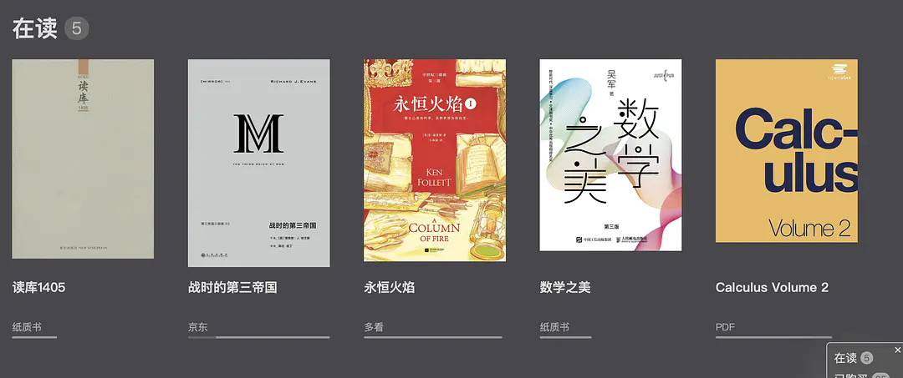

# 电子书架
## 概述
这是一个电子书架单页面应用。起因是我希望能把纸质书和电子书（多个平台的）放在一个空间观赏，就自己做了个网页，可以算是一个虚拟书架。
分为四个区域，在读，已购买（买了还没开始读），已读，暂停（读不下去的）。
可以按照书的介质（纸质书、电子书的各个平台）、页数筛选。
每本书除了显示封面和书名，还显示其介质和页数（用一根横线的长短表示），读过的书还显示我对此书的评分。




本来我是用豆瓣的「在读」、「已读」功能，加上自建豆列来记录这些书的，用了几年后发现以下问题：
1. 「在读」、「已读」以及豆列中书很多（比如我已读的有几百本）时，需要不断翻页浏览，在大屏幕PC端体验不好，我希望的是在一个页面上下滚动浏览、有那种画廊的感觉。
2. 「在读」、「已读」以及豆列都没有搜索功能。
3. 不能区分书的介质：纸质书、电子书的多个平台（多看、当当、京东、微信读书）、以及PDF文件等。
4. 一次偶然发现我读过的一本书（徐中约的《中国近代史》）在豆瓣消失了，想到其它的书也可能随时消失，就想把自己读过的书记录到自己的一个文件。一开始自然的想法是用Excel记录，后来结合上面不方便的地方，索性自己做了个网页，兼具记录和浏览观赏的功能。

这个网页就是一个保存在我自己电脑上的HTML文件，并不在互联网上。书的封面图片都是引用豆瓣的，如果我建立了一个真正的网站引用豆瓣的图片，恐怕豆瓣是不会允许的。

## 使用方法
1. 下载[books.html](books.html)到本地。
2. 用任意文本编辑器打开`books.html`，找到4个JSON列表：`readingBooks`（在读）、`boughtBooks`（已购买）、`readBooks`（读过）、`suspendedBooks`（暂停），列表的每一行是一本书（每一行的结构见下一节「数据结构」），把自己的书的信息输入进去。
3. 用浏览器打开`books.html`，即可看到网页（点击[此处](https://liqi4096.github.io/books/books.html)查看样例）。

## 数据结构
每本书用一个JSON对象表示，结构如下：
```
{
    "name":"", // 书名
    "readDate":"", // 读完的日期，没读完的书此字段为空
    "rating":"", // 个人评分，数字1到5，在界面上会渲染成几颗星的样子
    "media":"", // 书介质，可任意写，例如纸质书，电子书的各个平台（多看、京东、微信读书等），PDF等
    "pages":"", // 页数，在界面上会渲染成一条横线，用横线的长度表示页数的多少
    "doubanUrl":"", // 此书在豆瓣的地址，点击后跳转
    "imageUrl":"", // 书封面图片，一般可取豆瓣的地址，也可用本地图片文件
    "comment":"" // 个人备注，如不为空，界面会显示一个图标，鼠标放到此图标上即可看到备注内容
}
```
